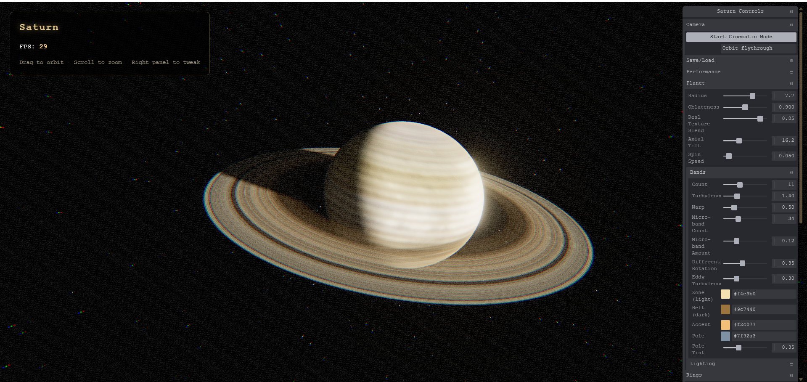

# WebGPU Saturn Visualizer




**Live demo:** [webgpu-saturn-visualize.vercel.app](https://webgpu-saturn-visualizer.vercel.app/)

A real-time, physically-flavoured Saturn renderer for the browser — an oblate,
turbulently-banded gas giant with real NASA/JPL-derived surface detail, a
ring system built from actual Cassini radial density data, mutual
planet/ring shadowing, forward light-scattering through the rings, a
procedural starfield + nebula sky, and a cinematic post-processing chain.
Runs live via WebGPU, fully tweakable in real time.


## Features

- **Real + procedural hybrid surface** — a real NASA/JPL-derived Saturn
  albedo map blended with procedural latitude bands, so the surface has
  genuine photographic detail *and* keeps animating (spin, turbulence) rather
  than sitting static like a plain texture
- **Differential rotation & eddies** — band sampling shears per-latitude
  (Saturn's equator rotates faster than its mid-latitudes) and a
  domain-warped turbulence layer concentrates swirling detail at band
  boundaries, where real zonal-jet instabilities occur
- **Ring system built on real data** — radial density profile sourced from
  actual Cassini ring measurements (C/B/A rings, Cassini division, Encke
  gap), blended with a procedural gaussian fallback and fine ringlet noise
- **Ring forward-scattering** — rings glow when backlit (camera looking
  toward the sun through the ring plane), approximating the way real ice
  particles preferentially scatter light forward — the effect visible in
  Cassini's famous backlit ring mosaics
- **Radius-coupled geometry** — ring bounds are derived as a ratio of planet
  radius, so resizing the planet scales the rings with it instead of leaving
  them stranded at a fixed size
- **Mutual shadows** — the rings cast their shadow across the globe and the
  planet casts its shadow across the rings, both driven by the sun direction
- **Sun lighting** — soft gas-giant terminator, limb darkening and an
  atmospheric backscatter rim on the lit edge
- **Procedural sky** — grid-placed starfield, two nebula layers, and an
  optional sun glow (the "sun peeking past Saturn" look)
- **Bloom + cinematic FX** — HDR bloom (tuned so it catches genuine
  highlights instead of blooming the whole lit disc to white), vignette,
  film grain, chromatic aberration
- **Real-time controls** — scrollable Tweakpane UI for every parameter, with
  save/load
- **Cinematic camera** — Catmull-Rom flythrough with eased (smootherstep)
  motion and a smooth blend-in from wherever the camera currently is, so
  starting it never produces a hard cut

## Requirements

- Browser with WebGPU support (Chrome 113+, Edge 113+)

## Getting Started

```bash
npm install
npm run dev      # dev server
npm run build    # production build
```

## Controls

- **Left Mouse Drag** — orbit camera
- **Mouse Wheel** — zoom
- **Right Panel** — adjust parameters (scrolls if it overflows the viewport)
- **Camera → Start Cinematic Mode** — automated flythrough

## How it works

Unlike the black hole (which raymarches curved spacetime), Saturn is a solid
body, so it's rendered with real geometry and depth-tested normally — the planet
occludes the rings behind it and the rings draw over it in front. Everything is
shaded with hand-written TSL `MeshBasicNodeMaterial` colour nodes so the
lighting, banding and shadows are fully under our control.

The planet and rings live in a single tilted group whose local frame has the
ring plane at `y = 0` and the spin axis at `+y`. Because a dot product is
invariant under that shared tilt, all lighting and shadow math is done in the
untilted local frame — which keeps the shadow rays (that intersect the `y = 0`
ring plane) simple while still matching world-space lighting.

The planet's albedo and the rings' radial density are each a blend of a real
texture (sampled via TSL `texture()`) and a procedural fallback, mixed by a
`textureBlend` uniform — so the real data drives large-scale accuracy while
the procedural layer keeps everything animating and fully parametric.

## Project Structure

- `main.js` — entry point: renderer/scene/camera, post-processing, config, loop
- `saturn.js` — `SaturnSimulation`: geometry, materials, textures and uniform management
- `saturn-shader.js` — planet + ring TSL shaders (bands, ring profile, shadows, scattering)
- `background-shader.js` — starfield, nebula and sun glow
- `noise.js` — shared hash / value-noise / FBM helpers
- `postfx.js` — cinematic post-processing (vignette, grain, chromatic aberration)
- `ui.js` — Tweakpane controls
- `camera-animation.js` — cinematic camera flythrough
- `public/saturn_2k.jpg` — Saturn albedo texture (see Credits)
- `public/saturn_ring_alpha_2k.png` — ring radial density/alpha map (see Credits)

## Tech Stack

- **[Three.js](https://threejs.org/) (WebGPU renderer + TSL)** — node-based
  shader authoring (`three/tsl`), compiled to WGSL at runtime
- **[Vite](https://vitejs.dev/)** — dev server and build
- **[Tweakpane](https://tweakpane.github.io/docs/)** — real-time control panel
- Vanilla JavaScript (ES modules), no framework

